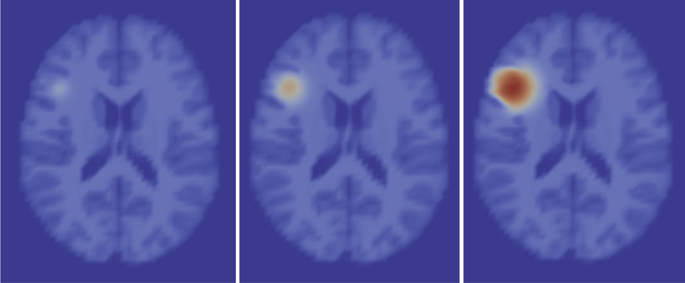

# Glioma solver: Tumor Growth Model
This example simulates tumor growth in patient anatomy using reaction-diffusion model. 

### Compilation & Running
Set up enviroment, e.g. on the local computer called kraken and compile to get executable ```brain```. Put the executable in the folder ```TumorGrowth``` and run the simulation using the ```run_kraken.sh```:
```sh
cd makefile
source setup_kraken.sh
make clean && make -j 4
cp brain ../Examples/TumorGrowth 
cd ../Examples/TumorGrowth
./run_kraken.sh
```
For running on SLURM cluster, use the scripts with keyword lrz and submit as  ```sbatch run_lrz.sh ```. The  ```run_*.sh ``` contains execution command and simulaiton input parameters.

### Input parameters

| Parameter        | Description     |
| ------------- |:-----------------|
| `N`  | Number of OMP threads to be used|
| `program`   | Name of executable, here `brain` |
| `model`   | The name of simulation model to be used, use `RD` for Reaction-Diffusion model. |
| `verbose`   | Set to `0/1` to disable/enable simulation printouts |
| `profiler`   | Set to `0/1` to disable/enable code profiling (for performance tests) |
| `adaptivty`   | Set to `0/1` to disable/enable adaptive grid refinment |
| `vtk`   | Set to `0/1` to disable/enable dumping output |
| `dumpfreq`   | Frequency of data dumping (w.r.t simulation time, i.e every 50 days) |
| `PatFileName`   | Path to file with patient anatomy |
| `Dw`    | Diffusivity in white matter [cm^2/day] |
| `rho`   | Proliferation rate [1/day] |
| `Tend`  | Final simulation time [day] |

### Input anatomy
In the example anatomy of the patient is stored in `/Anatomy/Patient00/`. The input data should be provided in the format `.dat`. See `ProcessingData/source/convert_folder_content_nii2dat.m' for script converting nifty to dat and vice-versa. For each patient provide segmentation of wm, gm and csf, each in separate file with following name extension:
* *_WM.dat for wm
* *_GM.dat for gm
* *_CSF.dat for csf
 
### Output
If `vtk` is set to `1`, the solver will save output in the form `Data_000*.vtu`, where `*` is numbering of output data in chronological order, i.e. `Data_0000.vtu` is the inital conditon and `Data_0001.vtu` is the solution at time specified in 'dumpfreq'. The output files can be open in Paraview:


Figure: Tumor growth in patient anatomy.


### References
Please cite:
* Lipkova et al.: *Personalized Radiotherapy Planning for Glioma Using Multimodal Bayesian Model Calibration*, preprint arXiv:1807.00499, (2018)
* Rossinelli D, et al.: *Mrag-i2d: Multi-resolution adapted grids for remeshed vortex methods on multicore architectures.* Journal of Computational Physics 288:1–18, (2015).
